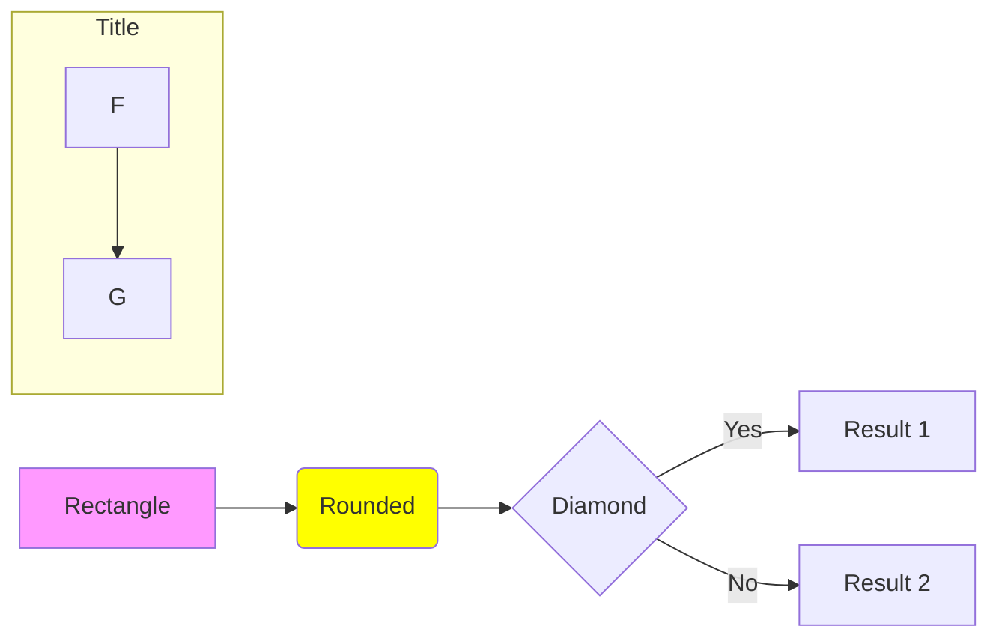
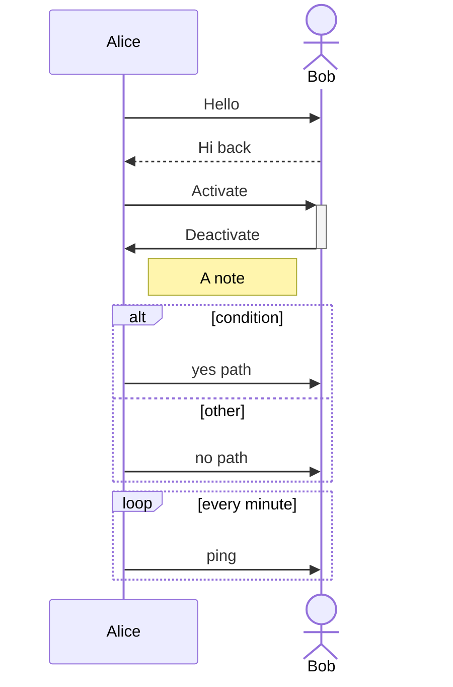
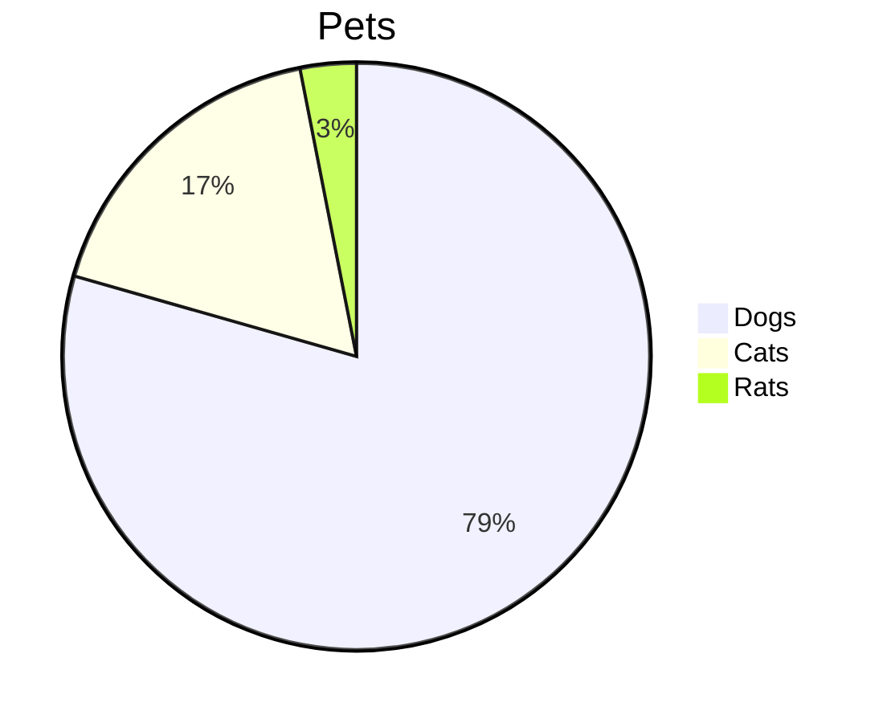

# mmgo Implementation Plan

## Overview

This plan builds mmgo in layers from the bottom up: foundational libraries first, then diagram-specific features, then CLI integration. Each step is a feature branch with PR review, following strict TDD (red → green → refactor).

---

## Phase 0: Project Scaffold

**Branch:** `feature/project-scaffold`

### 0.1 Initialize Go module
- `go mod init github.com/julianshen/mmgo`
- Create directory structure: `cmd/mmdc/`, `pkg/` sub-packages
- Add `.gitignore` for Go projects
- Add `LICENSE` (MIT)

### 0.2 CI setup
- GitHub Actions workflow: `go test ./... -race -cover`
- golangci-lint step
- Coverage threshold check (fail if <90%)
- Run on every PR to `main`

### 0.3 Makefile
- `make build` — builds CLI binary
- `make test` — runs tests with coverage
- `make lint` — runs golangci-lint
- `make cover` — generates HTML coverage report

**Deliverable:** Empty but buildable project with CI.

---

## Phase 1: Core Infrastructure

### Step 1 — Graph Data Structure

**Branch:** `feature/layout-graph`

Build `pkg/layout/graph/` — the directed graph data structure used by the layout engine.

**Requirements:**
- Add/remove nodes and edges with attributes (label, width, height, etc.)
- Adjacency queries: successors, predecessors, neighbors
- Compound graph support (nodes can belong to a parent/subgraph)
- Edge ID support (for multi-edges between same nodes)
- Topological ordering
- Graph copying/cloning

**Tests:**
- Node/edge CRUD operations
- Successor/predecessor correctness
- Compound graph parent/child relationships
- Topological sort on DAGs
- Edge cases: empty graph, single node, self-loops, disconnected components

**Estimated size:** ~300-400 lines + tests

---

### Step 2 — Text Measurement

**Branch:** `feature/textmeasure`

Build `pkg/textmeasure/` — font-based text bounding box computation.

**Requirements:**
- Load a TrueType/OpenType font from embedded bytes
- Measure text width and height at a given font size
- Handle multi-line text (split on `\n`, measure each line, return max width and total height)
- Bundle a default font (Source Sans Pro or similar OFL-licensed font)
- Include the OFL license text file alongside the bundled font (required by SIL Open Font License)
- Expose `Ruler` type with `Measure(text string, fontSize float64) (w, h float64)`

**Dependencies:** `golang.org/x/image/font`, `golang.org/x/image/font/sfnt`

**Tests:**
- Single character measurement
- Known string measurements (compare against font editor values)
- Multi-line text
- Empty string
- Unicode text
- Different font sizes (linear scaling)

**Estimated size:** ~150-200 lines + tests + embedded font file

---

### Step 3 — Diagram Types and Interfaces

**Branch:** `feature/diagram-types`

Build `pkg/diagram/` — shared AST types.

**Requirements:**
- `Diagram` interface with `Type() DiagramType` method
- `DiagramType` enum (Flowchart, Sequence, Pie, ...)
- Flowchart AST types: `FlowchartDiagram`, `Node`, `Edge`, `Subgraph`, `NodeShape`, `LineStyle`, `ArrowHead`, `Direction`
- Sequence AST types: `SequenceDiagram`, `Participant`, `Message`, `Block`, `Note`, `ArrowType`
- Pie AST types: `PieDiagram`, `Slice`

**Tests:**
- Type assertion tests (each concrete type satisfies Diagram interface)
- Builder/construction tests

**Estimated size:** ~200-300 lines + tests

---

### Step 4 — Layout Engine: Cycle Removal

**Branch:** `feature/layout-acyclic`

Build `pkg/layout/internal/acyclic/` — greedy feedback arc set.

**Algorithm:** Port dagre's `greedy-fas.ts` (~150 lines).

**Requirements:**
- Accept a `*graph.Graph`, identify back edges, reverse them
- Mark reversed edges for later un-reversal
- `Run(g *graph.Graph)` and `Undo(g *graph.Graph)` functions

**Tests:**
- Already-acyclic graph (no changes)
- Simple cycle (A→B→A)
- Complex cycles
- Self-loops
- Verify graph is acyclic after Run()
- Verify original edges restored after Undo()

**Estimated size:** ~150-200 lines + tests

---

### Step 5 — Layout Engine: Rank Assignment

**Branch:** `feature/layout-rank`

Build `pkg/layout/internal/rank/` — network simplex algorithm.

**Algorithm:** Port dagre's `rank/` directory (~255 lines + supporting files).

**Requirements:**
- Assign integer ranks (layers) to each node
- Minimize total edge length (sum of rank differences)
- Longest-path initialization
- Feasible tree construction
- Network simplex optimization loop

**Tests:**
- Linear chain (A→B→C) — ranks 0,1,2
- Diamond graph — verify rank constraints
- Compare rank assignment with dagre.js output on same graphs
- Disconnected components

**Estimated size:** ~300-400 lines + tests

---

### Step 6 — Layout Engine: Crossing Minimization

**Branch:** `feature/layout-order`

Build `pkg/layout/internal/order/` — barycenter heuristic.

**Algorithm:** Port dagre's `order/` directory (~400 lines across 9 files).

**Requirements:**
- Determine node order within each rank
- Barycenter computation
- Iterative up/down sweeping (4 passes)
- Cross-counting between adjacent layers
- Conflict resolution for flat edges

**Tests:**
- No crossings (already optimal)
- Simple crossing (two edges that cross)
- Complex multi-layer graphs
- Compare ordering with dagre.js output

**Estimated size:** ~400-500 lines + tests

---

### Step 7 — Layout Engine: Coordinate Assignment

**Branch:** `feature/layout-position`

Build `pkg/layout/internal/position/` — Brandes-Kopf algorithm.

**Algorithm:** Port dagre's `position/bk.ts` (~526 lines). Reference: Brandes & Kopf 2002 paper.

**Requirements:**
- Type-1 conflict detection
- Vertical alignment (block assignment)
- Horizontal compaction
- Four-orientation balancing (UL, UR, LL, LR → median)
- Final coordinate computation respecting node separation

**Tests:**
- Simple linear layout
- Wide vs tall graphs
- Verify no node overlaps
- Compare coordinates with dagre.js on known graphs (golden file tests)
- Stress test with large graphs (100+ nodes)

**Estimated size:** ~500-600 lines + tests

---

### Step 8 — Layout Engine: Integration

**Branch:** `feature/layout-integration`

Build `pkg/layout/layout.go` — the top-level `Layout()` function that orchestrates all phases.

**Requirements:**
- Accept `*graph.Graph` and `LayoutOptions`
- Run: normalize → acyclic → rank → order → position → edge routing → denormalize
- Return `*LayoutResult` with node/edge coordinates
- Edge routing: compute control points for edge paths

**Tests:**
- End-to-end layout of small flowcharts
- Golden file tests comparing full layout output with dagre.js
- LR, RL, TB, BT direction variants
- Graphs with subgraphs/compound nodes
- Edge label positioning

**Estimated size:** ~300-400 lines + tests

---

## Phase 2: Flowchart (First Diagram Type)

### Step 9 — Flowchart Parser

**Branch:** `feature/parser-flowchart`

Build `pkg/parser/flowchart/` — recursive descent parser for Mermaid flowchart syntax.

**Supported syntax:**


**Requirements:**
- Direction detection: `graph`/`flowchart` + `LR`/`RL`/`TD`/`TB`/`BT`
- Node parsing: ID, label, shape detection from delimiters (`[]`, `()`, `{}`, `(())`, `[[]]`, `[()]`, `{{}}`, `>]`, `[/\]`, `[\\/]`)
- Edge parsing: arrow types (`-->`, `---`, `-.->`, `==>`, `-->`), labels (`-->|text|`, `-- text -->`)
- Subgraph parsing: `subgraph id [label]` ... `end` (nested)
- Style directives: `style nodeId fill:...`, `classDef name fill:...`, `class nodeId name`
- Comment stripping: `%%`
- Init directives: `%%{init: {...}}%%`
- Multi-line support

**Tests:**
- Each node shape type
- Each edge/arrow type
- Subgraphs (flat and nested)
- Style and class directives
- Comments and directives
- Error cases: malformed syntax, unclosed subgraphs, unknown node references
- Real-world flowcharts from Mermaid docs and public repos

**Estimated size:** ~600-800 lines + tests

---

### Step 10 — Flowchart Renderer

**Branch:** `feature/renderer-flowchart`

Build `pkg/renderer/flowchart/` — converts flowchart AST + layout into SVG.

**Requirements:**
- Node shape rendering: rectangle, rounded rect, diamond, hexagon, parallelogram, cylinder, circle, double-circle, stadium, subroutine, etc.
- Edge rendering: straight lines or curves with arrow markers
- Edge labels: positioned at edge midpoint
- Subgraph rendering: grouped with background rectangle and title
- Text rendering: centered in nodes, with wrapping for long labels
- Theme support: apply colors from theme config
- SVG structure: `<svg>` with viewBox, `<defs>` for markers, `<g>` groups

**Tests:**
- Each node shape produces valid SVG elements
- Edge paths connect correct node positions
- Subgraph grouping
- Theme color application
- Golden file SVG comparisons
- Valid SVG output (parseable by XML parser)

**Estimated size:** ~500-700 lines + tests

---

### Step 11 — SVG Output and End-to-End

**Branch:** `feature/output-svg`

Build `pkg/output/svg/` and wire flowchart end-to-end.

**Requirements:**
- SVG document wrapper (XML declaration, svg element, viewBox)
- CSS style embedding for themes
- Full pipeline: `.mmd` text → parse → measure → layout → render → SVG string

**Tests:**
- End-to-end: known .mmd input → valid SVG output
- SVG is well-formed XML
- ViewBox dimensions match layout bounds
- Testdata fixtures with golden SVG files

**Estimated size:** ~100-200 lines + tests + testdata fixtures

---

## Phase 3: Sequence Diagram

### Step 12 — Sequence Parser

**Branch:** `feature/parser-sequence`

Build `pkg/parser/sequence/`.

**Supported syntax:**


**Requirements:**
- Participant/actor declarations with aliases
- All 8 message arrow types:
  - `->>` solid line with arrowhead
  - `->` solid line without arrowhead
  - `-->>` dashed line with arrowhead
  - `-->` dashed line without arrowhead
  - `-x` solid line with cross
  - `--x` dashed line with cross
  - `-)` solid line with open arrow (async)
  - `--)` dashed line with open arrow (async)
- Activation markers (`+`/`-` suffix)
- Notes: `Note left of`, `Note right of`, `Note over`
- Blocks: `alt`/`else`, `opt`, `loop`, `par`/`and`, `critical`/`option`, `break`, `rect`
- Auto-numbering
- Comments and directives

**Tests:** Table-driven for each syntax element. Real-world sequence diagrams.

**Estimated size:** ~500-700 lines + tests

---

### Step 13 — Sequence Renderer

**Branch:** `feature/renderer-sequence`

Build `pkg/renderer/sequence/`.

Sequence diagrams use a **custom layout** (not dagre). The layout is column-based:
- Participants are placed left-to-right with equal spacing
- Messages are drawn top-to-bottom in order
- Lifelines are vertical dashed lines
- Activation boxes are narrow rectangles on lifelines

**Requirements:**
- Participant box rendering
- Lifeline rendering (dashed vertical lines)
- Message rendering (horizontal arrows with labels)
- Activation bar rendering
- Note rendering (positioned relative to lifelines)
- Block rendering (alt/loop/opt boxes with labels)
- Auto-number rendering

**Estimated size:** ~600-800 lines + tests

---

## Phase 4: Pie Chart and Config

### Step 14 — Pie Parser and Renderer

**Branch:** `feature/pie-chart`

Pie charts are simple — good for validating the full pipeline with minimal complexity.

**Syntax:**


**Parser:** ~100 lines. **Renderer:** ~200 lines (SVG circle with arc paths).

---

### Step 15 — Config and Themes

**Branch:** `feature/config-themes`

Build `pkg/config/`.

**Requirements:**
- Load JSON config files (`--configFile`)
- Four built-in themes: default, dark, forest, neutral
- Theme variables: primary/secondary/tertiary colors, text color, background, line color, font family, font size
- Per-diagram-type configuration (flowchart padding, sequence margins, etc.)
- Init directive processing (`%%{init: {"theme": "dark"}}%%`)

**Tests:** Load each built-in theme. Override variables. Invalid config handling.

**Estimated size:** ~300-400 lines + tests

---

## Phase 5: CLI and Output Formats

### Step 16 — CLI

**Branch:** `feature/cli`

Build `cmd/mmdc/`.

**Requirements:**
- All CLI flags from the spec (see CLAUDE.md), using `spf13/pflag`
- Input: file path or `-` for stdin
- Output: SVG only in this step (format inferred from extension; error if `.png`/`.pdf` requested before Steps 17-18)
- Quiet mode: suppress non-error output
- Error reporting: clear messages with input line references
- Markdown mode and PNG/PDF output are deferred to Steps 17-19 and wired into the CLI there

**Tests:** Integration tests running the compiled binary on testdata fixtures.

**Estimated size:** ~300-400 lines + tests

---

### Step 17 — PNG Output

**Branch:** `feature/output-png`

Build `pkg/output/png/`.

**Approach:** Use `tdewolff/canvas` (pure Go 2D canvas with comprehensive SVG support). Fallback: `srwiley/oksvg` + `srwiley/rasterx` if canvas proves insufficient.

**Requirements:**
- Parse SVG string → rasterize to `image.Image` → encode as PNG
- Support `--scale` flag for DPR (2x, 3x)
- Support `--width`/`--height` for fixed dimensions
- Support `--backgroundColor` (including transparent)

**Tests:** Render known SVG → verify PNG dimensions and non-emptiness.

**Estimated size:** ~150-200 lines + tests

---

### Step 18 — PDF Output

**Branch:** `feature/output-pdf`

Build `pkg/output/pdf/`.

**Approach:** Use `go-pdf/fpdf` or similar.

**Requirements:**
- Embed rasterized diagram in PDF page
- `--pdfFit` scales diagram to fit page dimensions
- Support custom page size

**Estimated size:** ~100-150 lines + tests

---

### Step 19 — Markdown Processing

**Branch:** `feature/markdown-processing`

Build `pkg/output/markdown/`.

**Requirements:**
- Parse markdown, find ` ```mermaid ` code blocks
- Render each block to the specified output format
- Replace code blocks with `` references
- Sequential naming: `output-1.svg`, `output-2.svg`, etc.

**Estimated size:** ~150-200 lines + tests

---

## Phase 6: Additional Diagram Types

Each additional diagram type follows the same pattern: parser → renderer → tests.

### Step 20 — Class Diagram
**Branch:** `feature/class-diagram`

**Key syntax:** `classDiagram`, class definitions with fields/methods (`+String name`, `-int age`), visibility markers (`+`/`-`/`#`/`~`), relationships (`<|--` inheritance, `*--` composition, `o--` aggregation, `..>` dependency), multiplicity (`"1"`, `"0..*"`), annotations (`<<interface>>`, `<<abstract>>`).

**Layout:** Uses dagre (graph-based). Nodes are class boxes with compartments (name, fields, methods). Edges use relationship-specific arrow markers.

**Estimated size:** Parser ~500-600 lines, renderer ~400-500 lines + tests.

---

### Step 21 — State Diagram
**Branch:** `feature/state-diagram`

**Key syntax:** `stateDiagram-v2`, state declarations, transitions (`-->` with labels), composite/nested states (`state "name" { ... }`), `[*]` for start/end, fork/join (`<<fork>>`/`<<join>>`), choice (`<<choice>>`), notes.

**Layout:** Uses dagre (graph-based). Composite states render as nested subgraphs with rounded-rect containers. Start/end nodes are filled/hollow circles.

**Estimated size:** Parser ~500-700 lines (nesting is the hard part), renderer ~400-500 lines + tests.

---

### Step 22 — ER Diagram
**Branch:** `feature/er-diagram`

**Key syntax:** `erDiagram`, entity definitions with attributes (`string name PK`), relationships with cardinality (`||--o{` one-to-many, `}|--|{` many-to-many), relationship labels.

**Layout:** Uses dagre (graph-based). Entities are rectangles with attribute lists. Edges use crow's foot notation markers (||, |{, o{, }o, }|).

**Estimated size:** Parser ~400-500 lines, renderer ~400-500 lines (crow's foot markers are the complexity) + tests.

---

### Step 23 — Gantt Chart
**Branch:** `feature/gantt-chart`

**Key syntax:** `gantt`, `title`, `dateFormat`, `section`, tasks with status/dates (`task1 :done, a1, 2024-01-01, 30d`), dependencies (`after a1`), milestones, excludes.

**Layout:** Custom axis-based layout (not dagre). Horizontal time axis with tasks as bars. Sections group tasks vertically. Requires date parsing and duration computation.

**Estimated size:** Parser ~400-500 lines (date format handling), renderer ~500-600 lines (time axis, bars, dependencies) + tests.

---

### Step 24 — Mindmap
**Branch:** `feature/mindmap`

**Key syntax:** `mindmap`, indentation-based hierarchy (no explicit edges), node shapes (`(round)`, `[square]`, `{{bang}}`), icons, markdown in nodes.

**Layout:** Custom radial/tree layout (not dagre). Root node centered, children branch outward. Requires tree layout algorithm (Reingold-Tilford or similar).

**Estimated size:** Parser ~300-400 lines (indentation parsing), renderer ~400-500 lines (radial positioning, curved branches) + tests.

---

### Step 25+ — Remaining Types

Additional diagram types, roughly ordered by demand:

| Type | Parser est. | Renderer est. | Layout |
|------|------------|---------------|--------|
| GitGraph | ~400 lines | ~400 lines | Custom (commit DAG) |
| Timeline | ~200 lines | ~300 lines | Custom (axis-based) |
| Sankey | ~300 lines | ~400 lines | Custom (flow layout) |
| XY Chart | ~200 lines | ~300 lines | Custom (axis-based) |
| C4 (all 5 types) | ~500 lines | ~500 lines | Dagre |
| Quadrant | ~200 lines | ~200 lines | Custom (2D grid) |
| Kanban | ~200 lines | ~300 lines | Custom (columns) |
| Block | ~300 lines | ~300 lines | Dagre |

---

## Milestones

| Milestone | Steps | What Ships |
|-----------|-------|------------|
| **v0.1.0** | 0–11 | Flowchart SVG rendering, Go module API |
| **v0.2.0** | 12–15 | + Sequence diagrams, pie charts, themes |
| **v0.3.0** | 16–19 | + CLI with PNG/PDF output, markdown processing |
| **v0.4.0** | 20–22 | + Class, state, ER diagrams |
| **v0.5.0** | 23–25+ | + Gantt, mindmap, and remaining types |
| **v1.0.0** | — | Stable API, all major diagram types, >90% coverage |

## Build Order Rationale

The plan builds bottom-up for two reasons:

1. **Each layer is independently testable.** The graph data structure can be tested without parsers. The layout engine can be tested without renderers. This keeps the TDD cycle tight.

2. **The first end-to-end demo (Step 11) comes after only the essential pieces are built.** You can render a flowchart SVG without the CLI, PNG output, or any other diagram type. This validates the architecture early.

The layout engine (Steps 4–8) is built before parsers because it's the highest-risk component — porting dagre's algorithms correctly is the hardest part of the project. Getting it right early de-risks everything downstream.
